# Design Document: Warehouse Inventory Management System

## Overview

This document describes the complete technical design for a Real-Time Warehouse Management System (WMS) and Order Management Workflow for the InventoryHub e-commerce platform. The system extends the existing React + Java Spring Boot microservices stack (warehouse-service on :8088, orders-service on :9091, inventory-service on :9093, products-service on :9094, payment-service on :9096, shipping-service on :9097, auth-server on :2000, all routed through API Gateway on :9999).

The design covers ten integrated modules: real-time inventory tracking, warehouse zone workflows (Receiving → Storage → Picking → Packing → Dispatch), admin dashboard with RBAC, warehouse manager operations, courier/shipping integration, the complete order lifecycle, system architecture, database schema, advanced real-time features, and UI/UX flows. All modules are designed to integrate seamlessly with the existing Pixelbloom microservice ecosystem, the React frontend (`inventory-hub-react`), and the STOMP/SockJS WebSocket infrastructure already in place.

The architecture follows an event-driven, microservices pattern. Each domain boundary (inventory, orders, warehouse, shipping, payments) is owned by a dedicated Spring Boot service. Cross-service communication uses synchronous REST (via Feign/RestTemplate) for queries and asynchronous events (via an Outbox pattern + WebSocket broadcasts) for state changes. Redis provides distributed locking and caching; the existing `@Version` optimistic-lock on `Inventory` is retained and extended.

---

## Architecture

### High-Level System Architecture

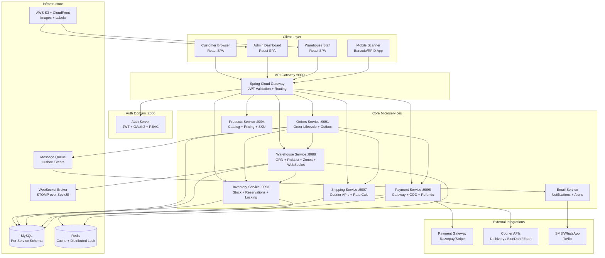

### Service Port Map

| Service | Port | Responsibility |
|---|---|---|
| API Gateway | 9999 | Routing, JWT validation, CORS |
| Auth Server | 2000 | Login, JWT, RBAC, staff management |
| Orders Service | 9091 | Order CRUD, status machine, outbox |
| Inventory Service | 9093 | Stock units, reservations, locking |
| Products Service | 9094 | Catalog, pricing, SKU, suppliers |
| Warehouse Service | 8088 | GRN, pick/pack, zones, WebSocket hub |
| Shipping Service | 9097 | Courier rates, AWB, tracking |
| Payment Service | 9096 | Gateway, COD, refunds, GST |
| Email Service | — | Async notifications |

---

## Module 1: Real-Time Inventory Tracking System

### Architecture

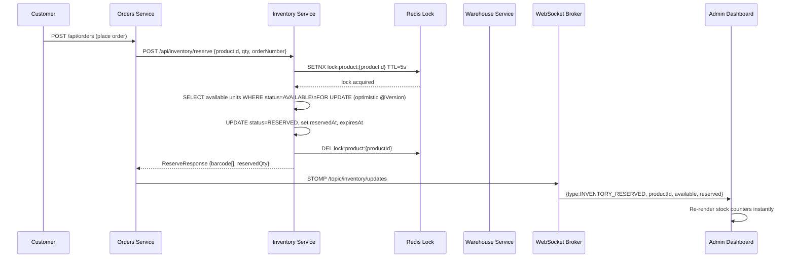

### Inventory State Machine

```
AVAILABLE ──reserve──► RESERVED ──confirm_sale──► SOLD
    ▲                       │
    │                  release (cancel/timeout)
    │                       │
    └───────────────────────┘
AVAILABLE ──damage──► DAMAGED
SOLD ──return──► AVAILABLE (if good) | DAMAGED (if defective)
```

### Core Data Model — Inventory (extends existing)

The existing `Inventory` entity (inventory-service) tracks individual stock units by barcode. The design adds aggregate views via Redis and a new `InventoryAggregate` projection:

```java
// Existing entity — no schema change needed
// inventory_service.inventory table
// id | barcode | productId | warehouseId | inventoryStatus | conditionStatus | @Version

// New: Redis aggregate key pattern
// Key: inv:agg:{warehouseId}:{productId}
// Value: {available: N, reserved: N, damaged: N, sold: N, lastUpdated: ISO}
// TTL: 30 seconds (refreshed on every mutation)
```

### Inventory Operations — Key Algorithms

**Reserve Stock (Oversell Prevention)**

```pascal
PROCEDURE reserveStock(orderNumber, items[])
  INPUT: orderNumber: String, items: [{productId, qty}]
  OUTPUT: ReserveResponse

  FOR each item IN items DO
    lockKey ← "lock:product:" + item.productId
    acquired ← redis.SETNX(lockKey, orderNumber, TTL=5000ms)

    IF NOT acquired THEN
      THROW ConcurrentReservationException("Product " + item.productId + " locked")
    END IF

    TRY
      units ← inventoryRepo.findAvailableUnits(item.productId, item.qty)

      IF units.size() < item.qty THEN
        THROW InsufficientStockException(item.productId, item.qty, units.size())
      END IF

      FOR each unit IN units DO
        unit.inventoryStatus ← RESERVED
        unit.reservedAt ← now()
        unit.expiresAt ← now() + 30min
        inventoryRepo.save(unit)  // @Version optimistic lock catches race
      END FOR

      reservation ← InventoryReservation {
        orderNumber, productId, quantity: item.qty,
        barcodes: units.map(u → u.barcode),
        status: RESERVED, expiresAt: now() + 30min
      }
      reservationRepo.save(reservation)

    FINALLY
      redis.DEL(lockKey)
    END TRY
  END FOR

  invalidateAggregateCache(items.map(i → i.productId))
  broadcastInventoryUpdate(items.map(i → i.productId))
  RETURN ReserveResponse{success: true, reservations}
END PROCEDURE
```

**Low Stock Alert**

```pascal
PROCEDURE checkLowStockAlerts(productId, warehouseId)
  available ← countAvailable(productId, warehouseId)
  threshold ← productConfig.getLowStockThreshold(productId)  // default: 10

  IF available <= threshold THEN
    alert ← LowStockAlert {
      productId, warehouseId, currentStock: available,
      threshold, severity: available == 0 ? OUT_OF_STOCK : LOW_STOCK
    }
    notificationService.send(alert)
    websocketBroker.send("/topic/admin/alerts", alert)
  END IF
END PROCEDURE
```

### API Contracts — Inventory Service

```
POST   /api/inventory/reserve              → Reserve units for order
POST   /api/inventory/release              → Release reserved units (cancel/timeout)
POST   /api/inventory/confirm-sale         → Mark RESERVED → SOLD (payment success)
POST   /api/inventory/return               → Process return (SOLD → AVAILABLE/DAMAGED)
GET    /api/inventory/aggregate/{warehouseId}/{productId} → Aggregate counts
GET    /api/inventory/low-stock            → Products below threshold
PATCH  /api/inventory/{id}/damage          → Mark unit as DAMAGED
POST   /api/inventory/transfer             → Transfer units between warehouses
GET    /api/inventory/warehouse/{id}       → All inventory for a warehouse
```

---

## Module 2: Warehouse Sections and Workflow

### Zone Architecture

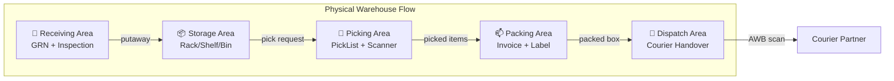

### 2.1 Receiving Area — GRN Workflow

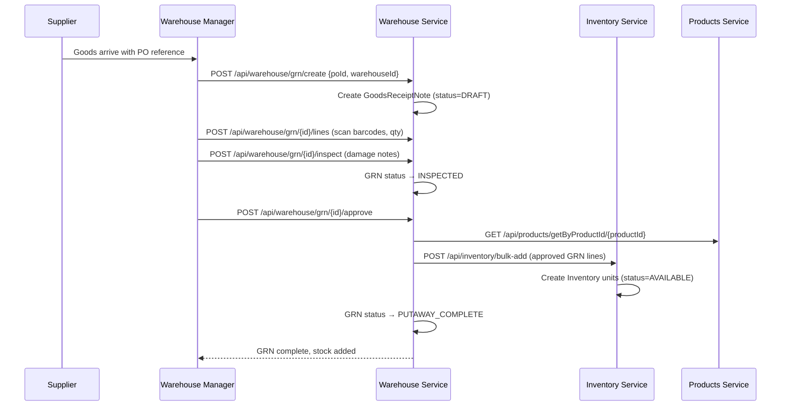

**GRN Status Flow:** `DRAFT → RECEIVED → INSPECTED → APPROVED → PUTAWAY_COMPLETE`

**Key Functions:**

```java
// GoodsReceiptNote entity (existing — warehouse-service)
// grnNumber | poId | warehouseId | status | receivedAt | inspectedBy | putawayCompleted

// GRNLine entity (existing)
// grnId | productId | barcode | orderedQty | receivedQty | damagedQty | putawayCompleted | locationCode
```

### 2.2 Storage Area — Location Hierarchy

The existing `WarehouseLocation` entity models the full hierarchy:

```
Warehouse (WH-PUN-001)
  └── Area (A, B, C)
       └── Aisle (01, 02)
            └── Bay (A, B)
                 └── Level (L1, L2, L3)
                      └── Bin (BIN01, BIN02)

Location Code: WH01-A-01-B-L2-BIN03
```

**Putaway Algorithm (Smart Allocation):**

```pascal
PROCEDURE allocatePutawayLocation(productId, warehouseId, qty)
  INPUT: productId, warehouseId, qty
  OUTPUT: locationCode

  // 1. Check preferred location for product
  preferred ← locationRepo.findByPreferredProductId(productId, warehouseId)
  IF preferred != null AND preferred.hasCapacity(qty) THEN
    RETURN preferred.locationCode
  END IF

  // 2. Check preferred location for category
  product ← productClient.getProductById(productId)
  categoryPreferred ← locationRepo.findByPreferredCategoryId(product.categoryId, warehouseId)
  IF categoryPreferred != null AND categoryPreferred.hasCapacity(qty) THEN
    RETURN categoryPreferred.locationCode
  END IF

  // 3. Find nearest available bin with capacity (fast-moving zone first)
  available ← locationRepo.findAvailableWithCapacity(warehouseId, qty,
                 sortBy: [FAST_MOVING_ZONE DESC, AVAILABLE_CAPACITY DESC])
  IF available.isEmpty() THEN
    THROW WarehouseCapacityException("No available bin for " + qty + " units")
  END IF

  RETURN available.first().locationCode
END PROCEDURE
```

### 2.3 Picking Area — PickList Workflow

The existing `PickList` and `PickListLine` entities are used. The workflow:

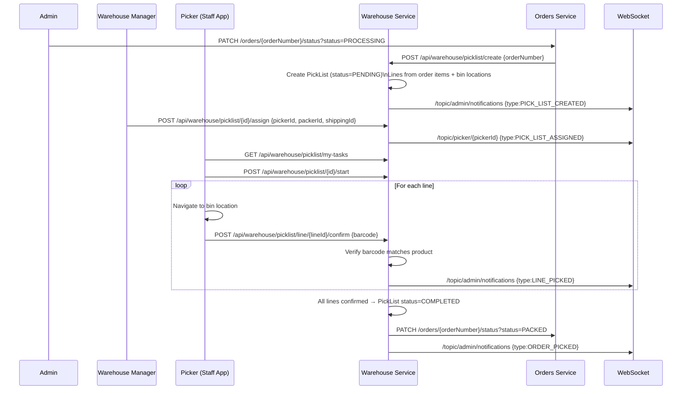

**Batch Picking Algorithm:**

```pascal
PROCEDURE generateBatchPickList(orderNumbers[])
  INPUT: orderNumbers: String[]
  OUTPUT: BatchPickList

  // Group items by bin location to minimize picker travel
  allLines ← []
  FOR each orderNumber IN orderNumbers DO
    lines ← pickListLineRepo.findByOrderNumber(orderNumber)
    allLines.addAll(lines)
  END FOR

  // Sort by location code (aisle → bay → level → bin)
  allLines.sortBy(line → line.locationCode)

  batchList ← BatchPickList {
    batchId: generateBatchId(),
    orderNumbers,
    lines: allLines,
    estimatedTime: allLines.size() * 45 // seconds per pick
  }
  RETURN batchList
END PROCEDURE
```

### 2.4 Packing Area

```pascal
PROCEDURE packOrder(orderNumber, packerId)
  INPUT: orderNumber, packerId
  OUTPUT: PackDetail

  pickList ← pickListRepo.findByOrderNumber(orderNumber)
  ASSERT pickList.status == COMPLETED

  order ← ordersClient.getOrder(orderNumber)
  items ← order.items

  // Weight verification
  actualWeight ← scannerService.getWeight()
  expectedWeight ← items.sum(i → i.product.weight * i.quantity)
  IF abs(actualWeight - expectedWeight) > WEIGHT_TOLERANCE THEN
    THROW WeightMismatchException(expected: expectedWeight, actual: actualWeight)
  END IF

  // Generate documents
  invoice ← invoiceService.generate(order)
  shippingLabel ← shippingService.generateLabel(order)
  packingSlip ← generatePackingSlip(order)

  packDetail ← PackDetail {
    orderNumber, packerId,
    packingSlipNumber: packingSlip.number,
    actualWeight, dimensions,
    invoiceUrl: invoice.url,
    labelUrl: shippingLabel.url,
    packedAt: now()
  }
  packDetailRepo.save(packDetail)

  // Update order status
  ordersClient.updateStatus(orderNumber, PACKED)
  RETURN packDetail
END PROCEDURE
```

### 2.5 Dispatch Area

```pascal
PROCEDURE dispatchOrder(orderNumber, awbNumber, courierPartner)
  INPUT: orderNumber, awbNumber, courierPartner
  OUTPUT: DispatchConfirmation

  packDetail ← packDetailRepo.findByOrderNumber(orderNumber)
  ASSERT packDetail != null

  // Scan AWB barcode to confirm
  scannedAwb ← scannerService.scanBarcode()
  ASSERT scannedAwb == awbNumber

  // Update order with AWB
  ordersClient.updateShipment(orderNumber, {
    awbNumber, courierPartner, shippedAt: now()
  })
  ordersClient.updateStatus(orderNumber, SHIPPED)

  // Notify customer
  notificationService.sendShipmentConfirmation(orderNumber, awbNumber)

  // Broadcast to admin dashboard
  websocketBroker.send("/topic/admin/notifications", {
    type: ORDER_SHIPPED, orderNumber, awbNumber, courierPartner
  })

  RETURN DispatchConfirmation{orderNumber, awbNumber, dispatchedAt: now()}
END PROCEDURE
```

### Order Status Flow

```
PENDING → CONFIRMED → PROCESSING → PACKED → SHIPPED → OUT_FOR_DELIVERY → DELIVERED
                                                                        ↓
                                                                    RETURNED
         ↓ (any stage before SHIPPED)
      CANCELLED
```

---
 

## Module 3: Admin Dashboard Features

### Component Architecture

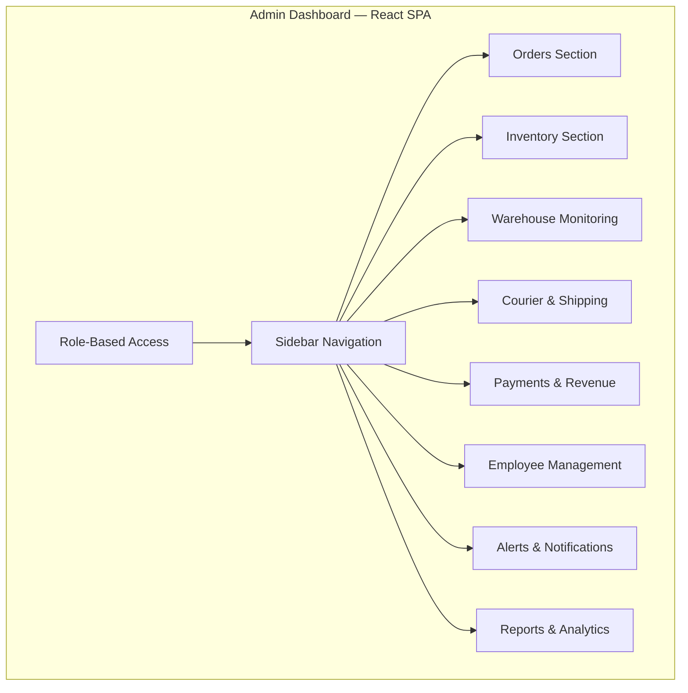

### 3.1 Orders Section

The existing `Orders.js` component already implements the core tab structure. The design extends it with:

**Stats Cards (already partially implemented):**

```javascript
// Extend existing stats array in Orders.js
const stats = [
  { label: 'Total',            value: allOrders.length },
  { label: 'Pending',          value: countByStatus('PENDING') },
  { label: 'Confirmed',        value: countByStatus('CONFIRMED') },
  { label: 'Processing',       value: countByStatus('PROCESSING') },
  { label: 'Packed',           value: countByStatus('PACKED') },
  { label: 'Shipped',          value: countByStatus('SHIPPED') },
  { label: 'Out for Delivery', value: countByStatus('OUT_FOR_DELIVERY') },
  { label: 'Delivered',        value: countByStatus('DELIVERED') },
  { label: 'Cancelled',        value: countByStatus('CANCELLED') },
  { label: 'Returned',         value: countByStatus('RETURNED') },
  { label: 'COD',              value: allOrders.filter(o => o.paymentMode === 'COD').length },
  { label: 'Prepaid',          value: allOrders.filter(o => o.paymentMode !== 'COD').length },
  { label: 'High Priority',    value: allOrders.filter(o => o.priority === 'HIGH').length },
  { label: 'Same Day',         value: allOrders.filter(o => o.deliverySpeed === 'SAME_DAY').length },
];
```

**Admin Actions API Contracts:**

```
PATCH  /api/auth/admin/orders/{orderNumber}/status?status={STATUS}
PATCH  /api/auth/admin/orders/{orderNumber}/warehouse?warehouseId={id}
PATCH  /api/auth/admin/orders/{orderNumber}/courier?partner={name}&awb={awb}
POST   /api/auth/admin/orders/{orderNumber}/cancel   {reason}
POST   /api/auth/admin/orders/{orderNumber}/refund
GET    /api/auth/admin/orders/{orderNumber}/tracking
```

### 3.2 Inventory Section

**Inventory Dashboard Stats:**

```javascript
// Inventory status categories
const inventoryStats = {
  available:   inventory.filter(i => i.inventoryStatus === 'AVAILABLE').length,
  reserved:    inventory.filter(i => i.inventoryStatus === 'RESERVED').length,
  lowStock:    inventory.filter(i => i.availableQty <= i.lowStockThreshold).length,
  outOfStock:  inventory.filter(i => i.availableQty === 0).length,
  fastSelling: inventory.filter(i => i.salesVelocity > FAST_SELLING_THRESHOLD).length,
  dead:        inventory.filter(i => i.lastSoldDays > DEAD_STOCK_DAYS).length,
  damaged:     inventory.filter(i => i.conditionStatus === 'DAMAGED').length,
};
```

**Admin Actions API Contracts:**

```
POST   /api/auth/admin/inventory/add-stock          {productId, warehouseId, qty, supplierId}
POST   /api/auth/admin/inventory/transfer           {productId, fromWarehouse, toWarehouse, qty}
PATCH  /api/auth/admin/inventory/{id}/damage        {reason, notes}
POST   /api/auth/admin/inventory/restock-alert      {productId, threshold}
GET    /api/auth/admin/inventory/warehouse/{id}     → warehouse-wise view
GET    /api/auth/admin/inventory/location/{code}    → rack/shelf/bin view
```

### 3.3 Warehouse Monitoring

**Real-Time Queue Dashboard:**

```javascript
// WebSocket subscription for live warehouse state
useWarehouseSocket({
  topics: [
    '/topic/warehouse/queues',
    '/topic/warehouse/capacity',
    '/topic/warehouse/workers'
  ],
  onMessage: (event) => {
    switch(event.type) {
      case 'QUEUE_UPDATE':    updatePickingQueue(event.data); break;
      case 'CAPACITY_UPDATE': updateCapacity(event.data); break;
      case 'WORKER_UPDATE':   updateWorkerStatus(event.data); break;
    }
  }
});
```

**Monitoring Metrics:**

```
- Active orders in each zone (Picking / Packing / Dispatch)
- Warehouse capacity utilization (%)
- Delayed operations (SLA breach alerts)
- Worker productivity (picks/hour, packs/hour)
- Scanner device status (online/offline)
- Same-day delivery countdown timers
```

### 3.4 Courier & Shipping

**Courier Rate Comparison:**

```javascript
// Courier partner rate card (existing shipping-service)
const courierRates = {
  'Delhivery': { baseRate: 72,  perKg: 18, codCharge: 35 },
  'BlueDart':  { baseRate: 110, perKg: 25, codCharge: 50 },
  'Ekart':     { baseRate: 65,  perKg: 15, codCharge: 30 },
};

// Auto-selection logic
function selectCourier(weight, pincode, deliverySpeed, isCOD) {
  const rates = calculateAllRates(weight, pincode, isCOD);
  if (deliverySpeed === 'SAME_DAY' || deliverySpeed === 'EXPRESS') {
    return rates.sort((a, b) => a.estimatedDays - b.estimatedDays)[0];
  }
  return rates.sort((a, b) => a.totalCharge - b.totalCharge)[0]; // cheapest
}
```

### 3.5 Payments & Revenue

**Revenue Dashboard API:**

```
GET  /api/auth/admin/payments/revenue/daily?date={date}
GET  /api/auth/admin/payments/revenue/monthly?month={YYYY-MM}
GET  /api/auth/admin/payments/cod/settlements
GET  /api/auth/admin/payments/refunds/pending
GET  /api/auth/admin/payments/gst-report?from={date}&to={date}
POST /api/auth/admin/payments/refund/approve  {refundId}
GET  /api/auth/admin/payments/invoices/download/{orderId}
```

### 3.6 Employee Management

```
GET  /api/auth/admin/warehouse-staff              → All staff list
GET  /api/auth/admin/warehouse-staff/attendance   → Today's attendance
POST /api/auth/admin/warehouse-staff/assign-shift {staffId, shift, date}
GET  /api/auth/admin/warehouse-staff/productivity → KPI report
GET  /api/auth/admin/warehouse-staff/{id}/tasks   → Assigned tasks
```

### 3.7 Role-Based Access Control (RBAC)

```java
// Roles and permissions matrix
enum AdminRole {
  SUPER_ADMIN,        // Full access — all modules
  WAREHOUSE_ADMIN,    // Warehouse ops, pick/pack, dispatch
  INVENTORY_ADMIN,    // Inventory CRUD, stock transfers, GRN
  FINANCE_ADMIN,      // Payments, refunds, GST reports
  SUPPORT_ADMIN       // Order status view, customer queries
}

// Permission checks (existing auth-server + Spring Security)
@PreAuthorize("hasRole('SUPER_ADMIN') or hasRole('WAREHOUSE_ADMIN')")
public ResponseEntity<?> assignPickList(...) { ... }

@PreAuthorize("hasRole('SUPER_ADMIN') or hasRole('FINANCE_ADMIN')")
public ResponseEntity<?> approveRefund(...) { ... }

@PreAuthorize("hasRole('SUPER_ADMIN') or hasRole('INVENTORY_ADMIN')")
public ResponseEntity<?> transferStock(...) { ... }
```

**Permission Matrix:**

| Feature | Super Admin | Warehouse Admin | Inventory Admin | Finance Admin | Support Admin |
|---|---|---|---|---|---|
| View Orders | ✅ | ✅ | ✅ | ✅ | ✅ |
| Change Order Status | ✅ | ✅ | ❌ | ❌ | ❌ |
| Manage Inventory | ✅ | ✅ | ✅ | ❌ | ❌ |
| Approve Refunds | ✅ | ❌ | ❌ | ✅ | ❌ |
| View Financial Reports | ✅ | ❌ | ❌ | ✅ | ❌ |
| Manage Staff | ✅ | ✅ | ❌ | ❌ | ❌ |
| System Config | ✅ | ❌ | ❌ | ❌ | ❌ |

---

## Module 4: Warehouse Manager Responsibilities

### Manager Dashboard — Key Functions

```pascal
PROCEDURE dailyManagerWorkflow(managerId, warehouseId)
  // Morning: Review overnight orders
  pendingPickLists ← pickListRepo.findPending(warehouseId)
  FOR each pickList IN pendingPickLists DO
    availablePickers ← staffRepo.findAvailableByRole(PICKER, warehouseId)
    IF availablePickers.isEmpty() THEN
      alertService.send(INSUFFICIENT_STAFF, managerId)
    ELSE
      assignPickList(pickList.id, availablePickers.first().id)
    END IF
  END FOR

  // Monitor SLA breaches
  delayedOrders ← orderRepo.findDelayedBeyondSLA(warehouseId)
  FOR each order IN delayedOrders DO
    escalationService.escalate(order, managerId)
  END FOR

  // Check low stock
  lowStockItems ← inventoryService.getLowStock(warehouseId)
  IF lowStockItems.size() > 0 THEN
    purchaseOrderService.createReorderRequest(lowStockItems)
  END IF

  // Same-day delivery priority queue
  sameDayOrders ← orderRepo.findSameDayPending(warehouseId)
  prioritizePickLists(sameDayOrders)
END PROCEDURE
```

### Manager API Contracts

```
GET  /api/warehouse/manager/dashboard/{warehouseId}   → Full dashboard state
GET  /api/warehouse/manager/sla-breaches              → Delayed operations
POST /api/warehouse/manager/reorder-request           → Trigger purchase order
GET  /api/warehouse/manager/worker-productivity       → KPI metrics
POST /api/warehouse/manager/priority-override         → Change order priority
GET  /api/warehouse/manager/scanner-status            → Device health
```

---

## Module 5: Shipping & Courier Integration

### Shipping Rate Calculation

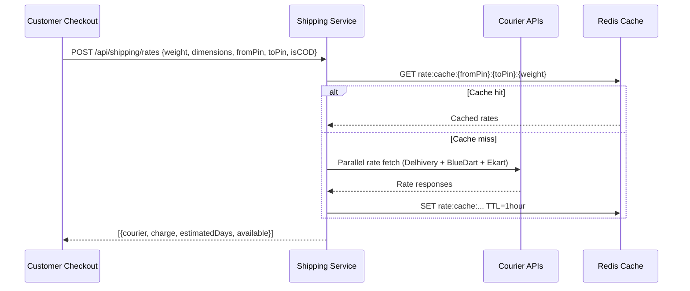

### Volumetric Weight Algorithm

```pascal
FUNCTION calculateShippingCharge(weight, length, height, breadth, pincode, isCOD, courier)
  INPUT: weight(kg), dimensions(cm), pincode, isCOD, courier
  OUTPUT: charge(₹)

  // Volumetric weight (standard formula)
  volumetricWeight ← (length * height * breadth) / 5000

  // Billable weight = max of actual vs volumetric
  billableWeight ← MAX(weight, volumetricWeight)

  // Base rate lookup
  rateCard ← courierRates[courier]
  zone ← pincodeZoneMap.getZone(pincode)

  charge ← rateCard.baseRate + (billableWeight * rateCard.perKgRate[zone])

  // COD surcharge
  IF isCOD THEN
    charge ← charge + rateCard.codCharge
  END IF

  // GST on shipping (18%)
  charge ← charge * 1.18

  RETURN ROUND(charge, 2)
END FUNCTION
```

### Courier API Integration

```java
// ShippingService — courier adapter pattern
interface CourierAdapter {
    ShippingRate calculateRate(ShippingRateRequest request);
    AWBResponse generateAWB(ShipmentRequest request);
    TrackingResponse trackShipment(String awbNumber);
    void cancelShipment(String awbNumber);
}

// Implementations: DelhiveryAdapter, BlueDartAdapter, EkartAdapter
// Each adapter handles auth, rate limits, and response mapping

// Auto-selection
public CourierRecommendation selectCourier(
    double weight, String pincode, String deliverySpeed, boolean isCOD
) {
    List<ShippingRate> rates = getAllRates(weight, pincode, isCOD);
    if ("SAME_DAY".equals(deliverySpeed) || "EXPRESS".equals(deliverySpeed)) {
        return rates.stream()
            .filter(r -> r.getEstimatedDays() <= 1)
            .min(Comparator.comparing(ShippingRate::getTotalCharge))
            .orElseThrow();
    }
    return rates.stream()
        .min(Comparator.comparing(ShippingRate::getTotalCharge))
        .orElseThrow();
}
```

### Shipping Service API Contracts

```
POST  /api/shipping/rates              → Get rates from all couriers
POST  /api/shipping/awb/generate       → Generate AWB number
GET   /api/shipping/track/{awbNumber}  → Real-time tracking
POST  /api/shipping/label/generate     → Generate shipping label PDF
POST  /api/shipping/cancel/{awbNumber} → Cancel shipment
GET   /api/shipping/performance        → Courier performance metrics
```

---

## Module 6: Complete Real-Time Order Lifecycle

### Full Order Flow — Event Sequence

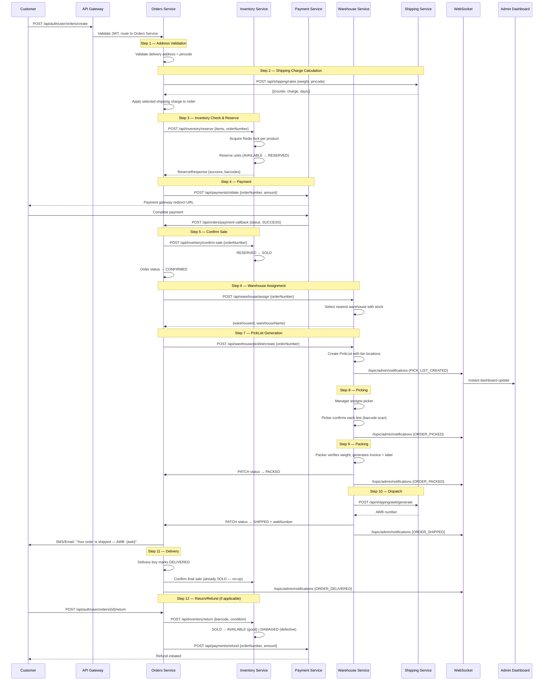

### Order Service — Key Functions

```java
// OrderService.java — core lifecycle methods

public Order createOrder(CreateOrderRequest req, Long customerId) {
    // 1. Validate address
    validateDeliveryAddress(req.getDeliveryAddress());

    // 2. Calculate shipping
    ShippingRate rate = shippingService.getBestRate(req);

    // 3. Reserve inventory
    ReserveResponse reservation = inventoryService.reserve(
        req.getItems(), generateOrderNumber()
    );
    if (!reservation.isSuccess()) {
        throw new InsufficientStockException(reservation.getFailedItems());
    }

    // 4. Create order record
    Order order = Order.builder()
        .orderNumber(reservation.getOrderNumber())
        .customerId(customerId)
        .orderStatus(OrderStatus.PENDING)
        .paymentStatus(PaymentStatus.PENDING)
        .totalAmount(calculateTotal(req.getItems(), rate))
        .shippingCharge(rate.getTotalCharge())
        .deliveryPincode(req.getDeliveryAddress().getPincode())
        .deliverySpeed(req.getDeliverySpeed())
        .build();

    return orderRepository.save(order);
}

public void handlePaymentSuccess(String orderNumber) {
    Order order = findByOrderNumber(orderNumber);
    inventoryService.confirmSale(orderNumber);          // RESERVED → SOLD
    order.setOrderStatus(OrderStatus.CONFIRMED);
    order.setPaymentStatus(PaymentStatus.SUCCESS);
    orderRepository.save(order);
    warehouseService.assignWarehouse(orderNumber);      // trigger warehouse flow
    websocketBroker.send("/topic/admin/notifications",
        new OrderEvent("ORDER_CONFIRMED", orderNumber));
}
```

---

## Module 7: Technical System Architecture

### Frontend Architecture (React)

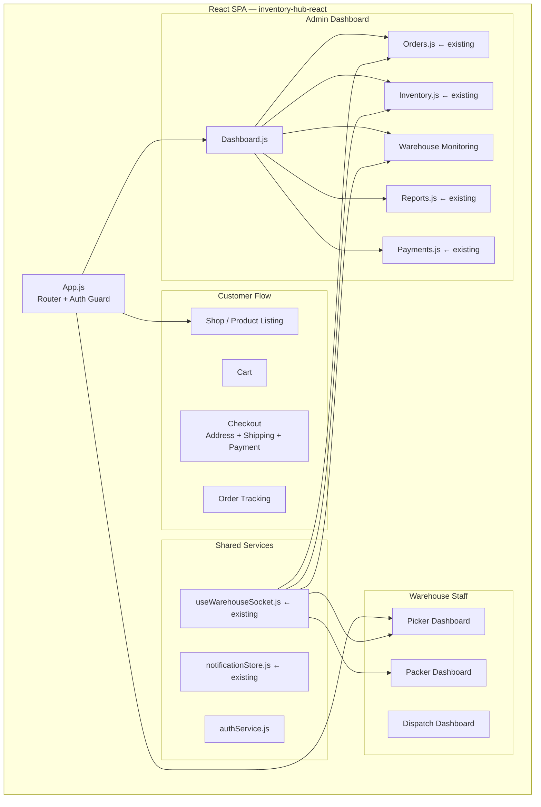

**State Management Pattern:**

```javascript
// Redux store slices (or Context API — match existing pattern)
const store = {
  auth:      { user, token, role, permissions },
  orders:    { list, filters, selectedOrder, loading },
  inventory: { items, aggregates, lowStockAlerts },
  warehouse: { queues, capacity, workers, scanners },
  shipping:  { rates, activeShipments, courierPerformance },
  payments:  { transactions, revenue, pendingRefunds },
  notifications: { items, unreadCount }
};
```

**WebSocket Integration (extends existing `useWarehouseSocket.js`):**

```javascript
// useWarehouseSocket.js — existing hook, extend topics
const WAREHOUSE_TOPICS = {
  ADMIN_NOTIFICATIONS: '/topic/admin/notifications',
  INVENTORY_UPDATES:   '/topic/inventory/updates',
  ORDER_UPDATES:       '/topic/orders/updates',
  WAREHOUSE_QUEUES:    '/topic/warehouse/queues',
  PICKER_TASKS:        (pickerId) => `/topic/picker/${pickerId}`,
  PACKER_TASKS:        (packerId) => `/topic/packer/${packerId}`,
};
```

### Backend Architecture (Java Spring Boot Microservices)

**Inter-Service Communication:**

```java
// Synchronous (RestTemplate / Feign) — for queries
// Existing pattern: ProductClient.java uses RestTemplate

// Pattern for all service clients:
@Component
public class InventoryClient {
    @Value("${inventory.service.url:http://localhost:9093}")
    private String inventoryServiceUrl;

    public ReserveResponse reserve(ReserveRequest request) {
        return restTemplate.postForObject(
            inventoryServiceUrl + "/api/inventory/reserve",
            request, ReserveResponse.class
        );
    }
}

// Asynchronous (Outbox Pattern) — for state changes
// Existing: OrderOutbox entity in orders-service
// Pattern: Save event to outbox table → scheduled job publishes → WebSocket broadcast
```

**Distributed Locking (Redis):**

```java
@Service
public class InventoryLockService {
    private final StringRedisTemplate redis;

    public boolean acquireLock(String productId, String requestId, long ttlMs) {
        String key = "lock:product:" + productId;
        Boolean acquired = redis.opsForValue()
            .setIfAbsent(key, requestId, Duration.ofMillis(ttlMs));
        return Boolean.TRUE.equals(acquired);
    }

    public void releaseLock(String productId, String requestId) {
        String key = "lock:product:" + productId;
        String current = redis.opsForValue().get(key);
        if (requestId.equals(current)) {
            redis.delete(key);
        }
    }
}
```

**WebSocket Configuration (Warehouse Service):**

```java
// Existing STOMP/SockJS setup in warehouse-service
// Endpoint: /ws (routed via API Gateway routes [41] and [42])
// Broker: /topic (broadcast), /queue (point-to-point)

@Configuration
@EnableWebSocketMessageBroker
public class WebSocketConfig implements WebSocketMessageBrokerConfigurer {
    @Override
    public void configureMessageBroker(MessageBrokerRegistry config) {
        config.enableSimpleBroker("/topic", "/queue");
        config.setApplicationDestinationPrefixes("/app");
    }

    @Override
    public void registerStompEndpoints(StompEndpointRegistry registry) {
        registry.addEndpoint("/ws")
            .setAllowedOriginPatterns("*")
            .withSockJS();
    }
}
```

### Infrastructure

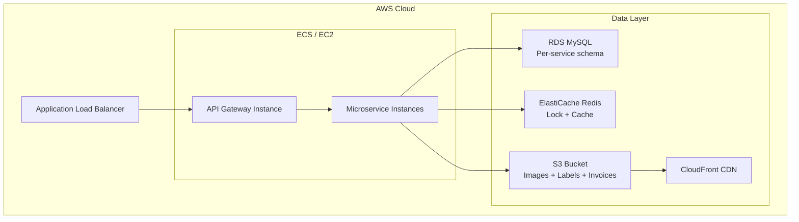

**Redis Usage:**

| Key Pattern | Purpose | TTL |
|---|---|---|
| `lock:product:{productId}` | Inventory reservation lock | 5 seconds |
| `inv:agg:{warehouseId}:{productId}` | Aggregate stock counts | 30 seconds |
| `rate:cache:{fromPin}:{toPin}:{weight}` | Shipping rate cache | 1 hour |
| `session:{userId}` | User session | 24 hours |
| `otp:{phone}` | OTP verification | 5 minutes |

---

## Module 8: Database Design

### Schema Overview

All services use MySQL (existing). Each service owns its schema. Cross-service references use IDs (no foreign keys across services).

### 8.1 Auth Server Schema

```sql
-- users (existing auth-server)
CREATE TABLE users (
    id            BIGINT PRIMARY KEY AUTO_INCREMENT,
    email         VARCHAR(255) UNIQUE NOT NULL,
    password_hash VARCHAR(255) NOT NULL,
    first_name    VARCHAR(100),
    last_name     VARCHAR(100),
    phone         VARCHAR(20),
    role          ENUM('CUSTOMER','ADMIN','WAREHOUSE_STAFF','DELIVERY_BOY') NOT NULL,
    admin_role    ENUM('SUPER_ADMIN','WAREHOUSE_ADMIN','INVENTORY_ADMIN','FINANCE_ADMIN','SUPPORT_ADMIN'),
    is_active     BOOLEAN DEFAULT TRUE,
    created_at    DATETIME NOT NULL,
    updated_at    DATETIME
);

-- warehouse_staff (new — auth-server)
CREATE TABLE warehouse_staff (
    id            BIGINT PRIMARY KEY AUTO_INCREMENT,
    user_id       BIGINT NOT NULL,           -- FK → users.id
    warehouse_id  BIGINT NOT NULL,           -- FK → warehouses.id (warehouse-service)
    staff_role    ENUM('PICKER','PACKER','SHIPPING','MANAGER') NOT NULL,
    employee_code VARCHAR(50) UNIQUE,
    shift         ENUM('MORNING','AFTERNOON','NIGHT'),
    is_active     BOOLEAN DEFAULT TRUE,
    created_at    DATETIME NOT NULL
);

INDEX idx_warehouse_staff_warehouse (warehouse_id);
INDEX idx_warehouse_staff_role (staff_role);
```

### 8.2 Products Service Schema

```sql
-- products (existing)
CREATE TABLE products (
    product_id    BIGINT PRIMARY KEY AUTO_INCREMENT,
    name          VARCHAR(255) NOT NULL,
    product_barcode VARCHAR(100) UNIQUE,
    category_id   BIGINT,
    subcategory_id BIGINT,
    sku           VARCHAR(100) UNIQUE,       -- NEW: SKU management
    weight_kg     DECIMAL(8,3),              -- NEW: for shipping calc
    length_cm     DECIMAL(8,2),              -- NEW: volumetric weight
    height_cm     DECIMAL(8,2),
    breadth_cm    DECIMAL(8,2),
    status        ENUM('ACTIVE','INACTIVE','DISCONTINUED'),
    description   TEXT,
    created_at    DATETIME NOT NULL,
    updated_at    DATETIME
);

-- product_pricing (existing)
CREATE TABLE product_pricing (
    id            BIGINT PRIMARY KEY AUTO_INCREMENT,
    product_id    BIGINT NOT NULL,
    mrp           DECIMAL(12,2) NOT NULL,
    selling_price DECIMAL(12,2) NOT NULL,
    cost_price    DECIMAL(12,2),
    discount      DECIMAL(5,2),
    gst_rate      DECIMAL(5,2) DEFAULT 18.00,
    unit_size     DOUBLE,
    unit_label    VARCHAR(20),
    created_at    DATETIME NOT NULL,
    updated_at    DATETIME
);

-- suppliers (existing — products-service)
CREATE TABLE suppliers (
    id            BIGINT PRIMARY KEY AUTO_INCREMENT,
    name          VARCHAR(255) NOT NULL,
    contact_email VARCHAR(255),
    contact_phone VARCHAR(20),
    address       TEXT,
    gstin         VARCHAR(20),
    is_active     BOOLEAN DEFAULT TRUE,
    created_at    DATETIME NOT NULL
);
```

### 8.3 Inventory Service Schema

```sql
-- inventory (existing — extended)
CREATE TABLE inventory (
    id                BIGINT PRIMARY KEY AUTO_INCREMENT,
    barcode           VARCHAR(100) UNIQUE NOT NULL,
    product_id        BIGINT NOT NULL,
    category_id       BIGINT,
    subcategory_id    BIGINT,
    warehouse_id      BIGINT NOT NULL,
    location_code     VARCHAR(100),          -- NEW: bin location
    inventory_status  ENUM('AVAILABLE','RESERVED','SOLD','DAMAGED') NOT NULL,
    platform_status   ENUM('ENABLED','DISABLED') NOT NULL,
    condition_status  ENUM('GOOD','CUSTOMER_DAMAGED','WAREHOUSE_DAMAGED') NOT NULL,
    mrp               DECIMAL(12,2),
    showroom_price    DECIMAL(12,2),
    buy_price         DECIMAL(12,2),
    selling_price     DECIMAL(12,2),
    stock_source      ENUM('SUPPLIER','CUSTOMER_RETURN') NOT NULL,
    is_customer_returned BOOLEAN DEFAULT FALSE,
    is_warehouse_damaged BOOLEAN DEFAULT FALSE,
    order_returned_initiated_at DATETIME,
    version           BIGINT DEFAULT 0,      -- optimistic lock
    created_at        DATETIME NOT NULL,
    updated_at        DATETIME,
    created_by        BIGINT,
    updated_by        BIGINT
);

INDEX idx_inventory_product_status (product_id, inventory_status);
INDEX idx_inventory_warehouse (warehouse_id);
INDEX idx_inventory_location (location_code);

-- inventory_reservation (existing)
CREATE TABLE inventory_reservation (
    id                BIGINT PRIMARY KEY AUTO_INCREMENT,
    order_number      VARCHAR(100) NOT NULL,
    product_id        BIGINT NOT NULL,
    category_id       BIGINT,
    subcategory_id    BIGINT,
    inventory_id      BIGINT NOT NULL,
    quantity          INT NOT NULL,
    barcode           VARCHAR(100) UNIQUE NOT NULL,
    reservation_status ENUM('RESERVED','RELEASED','CONFIRMED') NOT NULL,
    reserved_at       DATETIME,
    expires_at        DATETIME
);

INDEX idx_reservation_order (order_number);
INDEX idx_reservation_expires (expires_at);

-- inventory_transaction (existing — audit trail)
CREATE TABLE inventory_transaction (
    id            BIGINT PRIMARY KEY AUTO_INCREMENT,
    inventory_id  BIGINT NOT NULL,
    product_id    BIGINT NOT NULL,
    warehouse_id  BIGINT NOT NULL,
    transaction_type ENUM('INBOUND','OUTBOUND','RESERVE','RELEASE','TRANSFER','DAMAGE','RETURN'),
    quantity      INT NOT NULL,
    order_number  VARCHAR(100),
    reference_id  VARCHAR(100),
    notes         TEXT,
    created_by    BIGINT,
    created_at    DATETIME NOT NULL
);
```

### 8.4 Warehouse Service Schema

```sql
-- warehouses (existing)
CREATE TABLE warehouses (
    id              BIGINT PRIMARY KEY AUTO_INCREMENT,
    code            VARCHAR(50) UNIQUE NOT NULL,
    name            VARCHAR(255) NOT NULL,
    address         TEXT,
    city            VARCHAR(100),
    state           VARCHAR(100),
    pincode         VARCHAR(10),
    contact_person  VARCHAR(255),
    contact_phone   VARCHAR(20),
    contact_email   VARCHAR(255),
    capacity_sqft   DECIMAL(10,2),
    is_active       BOOLEAN DEFAULT TRUE,
    created_at      DATETIME NOT NULL,
    updated_at      DATETIME
);

-- warehouse_locations (existing — full hierarchy)
CREATE TABLE warehouse_locations (
    id                    BIGINT PRIMARY KEY AUTO_INCREMENT,
    warehouse_id          BIGINT NOT NULL,
    location_code         VARCHAR(50) UNIQUE NOT NULL,
    location_type         ENUM('AREA','AISLE','BAY','LEVEL','BIN') NOT NULL,
    area                  VARCHAR(10),
    aisle                 VARCHAR(10),
    bay                   VARCHAR(10),
    level                 VARCHAR(10),
    bin_code              VARCHAR(20),
    capacity_uom          VARCHAR(20) NOT NULL,
    max_capacity          DECIMAL(10,2) NOT NULL,
    current_capacity      DECIMAL(10,2) NOT NULL DEFAULT 0,
    max_weight            DECIMAL(10,2),
    max_height            DECIMAL(10,2),
    temperature_controlled BOOLEAN DEFAULT FALSE,
    hazmat_approved       BOOLEAN DEFAULT FALSE,
    is_active             BOOLEAN DEFAULT TRUE,
    is_available          BOOLEAN DEFAULT TRUE,
    preferred_product_id  BIGINT,
    preferred_category_id BIGINT,
    created_at            DATETIME NOT NULL,
    updated_at            DATETIME
);

-- goods_receipt_notes (existing)
CREATE TABLE goods_receipt_notes (
    id                  BIGINT PRIMARY KEY AUTO_INCREMENT,
    grn_number          VARCHAR(50) UNIQUE NOT NULL,
    po_id               BIGINT NOT NULL,
    warehouse_id        BIGINT NOT NULL,
    status              ENUM('DRAFT','RECEIVED','INSPECTED','APPROVED','PUTAWAY_COMPLETE') NOT NULL,
    received_at         DATETIME NOT NULL,
    received_by         BIGINT,
    inspected_by        BIGINT,
    inspected_at        DATETIME,
    inspection_notes    TEXT,
    putaway_completed   BOOLEAN DEFAULT FALSE,
    putaway_completed_at DATETIME,
    notes               TEXT,
    created_at          DATETIME NOT NULL,
    updated_at          DATETIME
);

-- grn_lines (existing)
CREATE TABLE grn_lines (
    id                BIGINT PRIMARY KEY AUTO_INCREMENT,
    grn_id            BIGINT NOT NULL,
    product_id        BIGINT NOT NULL,
    barcode           VARCHAR(100),
    ordered_qty       INT NOT NULL,
    received_qty      INT NOT NULL,
    damaged_qty       INT DEFAULT 0,
    putaway_completed BOOLEAN DEFAULT FALSE,
    location_code     VARCHAR(100),
    notes             TEXT
);

-- pick_lists (existing)
CREATE TABLE pick_lists (
    id                    BIGINT PRIMARY KEY AUTO_INCREMENT,
    order_number          VARCHAR(100) UNIQUE NOT NULL,
    status                ENUM('PENDING','IN_PROGRESS','COMPLETED') NOT NULL,
    customer_id           BIGINT,
    warehouse_id          BIGINT,
    assigned_picker_id    BIGINT,
    assigned_picker_name  VARCHAR(255),
    assigned_picker_email VARCHAR(255),
    assigned_packer_id    BIGINT,
    assigned_packer_name  VARCHAR(255),
    assigned_packer_email VARCHAR(255),
    assigned_shipping_id  BIGINT,
    assigned_shipping_name VARCHAR(255),
    assigned_shipping_email VARCHAR(255),
    assigned_at           DATETIME,
    created_at            DATETIME NOT NULL,
    started_at            DATETIME,
    completed_at          DATETIME
);

-- pick_list_lines (existing)
CREATE TABLE pick_list_lines (
    id            BIGINT PRIMARY KEY AUTO_INCREMENT,
    pick_list_id  BIGINT NOT NULL,
    product_id    BIGINT NOT NULL,
    product_name  VARCHAR(255),
    barcode       VARCHAR(100),
    quantity      INT NOT NULL DEFAULT 1,
    location_code VARCHAR(100),
    location_id   BIGINT,
    confirmed     BOOLEAN DEFAULT FALSE,
    confirmed_at  DATETIME
);

-- pack_details (new)
CREATE TABLE pack_details (
    id                  BIGINT PRIMARY KEY AUTO_INCREMENT,
    order_number        VARCHAR(100) UNIQUE NOT NULL,
    packer_id           BIGINT,
    packing_slip_number VARCHAR(100),
    actual_weight_kg    DECIMAL(8,3),
    length_cm           DECIMAL(8,2),
    height_cm           DECIMAL(8,2),
    breadth_cm          DECIMAL(8,2),
    invoice_url         VARCHAR(500),
    label_url           VARCHAR(500),
    quality_check_passed BOOLEAN DEFAULT FALSE,
    packed_at           DATETIME,
    created_at          DATETIME NOT NULL
);

-- purchase_orders (existing)
CREATE TABLE purchase_orders (
    id              BIGINT PRIMARY KEY AUTO_INCREMENT,
    po_number       VARCHAR(50) UNIQUE NOT NULL,
    supplier_id     BIGINT NOT NULL,
    warehouse_id    BIGINT NOT NULL,
    status          ENUM('DRAFT','SENT','CONFIRMED','RECEIVED','CANCELLED') NOT NULL,
    total_amount    DECIMAL(12,2),
    expected_date   DATE,
    notes           TEXT,
    created_by      BIGINT,
    created_at      DATETIME NOT NULL,
    updated_at      DATETIME
);
```

### 8.5 Orders Service Schema

```sql
-- orders (existing — extended)
CREATE TABLE orders (
    id                  BIGINT PRIMARY KEY AUTO_INCREMENT,
    order_number        VARCHAR(100) UNIQUE NOT NULL,
    customer_id         BIGINT NOT NULL,
    order_status        ENUM('PENDING','CONFIRMED','PROCESSING','PACKED','SHIPPED',
                             'OUT_FOR_DELIVERY','DELIVERED','CANCELLED','RETURNED','FAILED') NOT NULL,
    payment_status      ENUM('PENDING','SUCCESS','FAILED','REFUNDED') NOT NULL,
    total_amount        DECIMAL(12,2),
    currency            VARCHAR(10) DEFAULT 'INR',
    payment_mode        ENUM('ONLINE','COD','WALLET'),
    priority            ENUM('NORMAL','HIGH','SAME_DAY') DEFAULT 'NORMAL',  -- NEW
    warehouse_id        BIGINT,
    warehouse_name      VARCHAR(255),
    packing_slip_number VARCHAR(100),
    awb_number          VARCHAR(100),
    courier_partner     VARCHAR(100),
    delivery_pincode    VARCHAR(10),
    delivery_speed      ENUM('STANDARD','EXPRESS','SAME_DAY'),
    shipping_charge     DECIMAL(10,2),
    cancellation_reason TEXT,
    cancelled_at        DATETIME,
    delivered_at        DATETIME,
    returned_initiated_at DATETIME,
    created_at          DATETIME NOT NULL,
    updated_at          DATETIME
);

INDEX idx_orders_status (order_status);
INDEX idx_orders_customer (customer_id);
INDEX idx_orders_warehouse (warehouse_id);
INDEX idx_orders_created (created_at);

-- order_items (existing)
CREATE TABLE order_items (
    id            BIGINT PRIMARY KEY AUTO_INCREMENT,
    order_id      BIGINT NOT NULL,
    order_number  VARCHAR(100) NOT NULL,
    product_id    BIGINT NOT NULL,
    product_name  VARCHAR(255),
    barcode       VARCHAR(100),
    quantity      INT NOT NULL,
    unit_price    DECIMAL(12,2),
    total_price   DECIMAL(12,2),
    gst_rate      DECIMAL(5,2),
    gst_amount    DECIMAL(12,2)
);

-- order_status_history (existing)
CREATE TABLE order_status_history (
    id            BIGINT PRIMARY KEY AUTO_INCREMENT,
    order_number  VARCHAR(100) NOT NULL,
    old_status    VARCHAR(50),
    new_status    VARCHAR(50) NOT NULL,
    changed_by    BIGINT,
    changed_by_role VARCHAR(50),
    notes         TEXT,
    created_at    DATETIME NOT NULL
);

-- returns (existing)
CREATE TABLE returns (
    id                BIGINT PRIMARY KEY AUTO_INCREMENT,
    order_number      VARCHAR(100) NOT NULL,
    customer_id       BIGINT NOT NULL,
    return_reason     TEXT,
    return_status     ENUM('REQUESTED','APPROVED','PICKED_UP','INSPECTED','REFUNDED','REJECTED'),
    return_type       ENUM('FULL','PARTIAL'),
    initiated_at      DATETIME NOT NULL,
    approved_at       DATETIME,
    refund_amount     DECIMAL(12,2),
    inspection_notes  TEXT
);

-- refunds (existing)
CREATE TABLE refunds (
    id              BIGINT PRIMARY KEY AUTO_INCREMENT,
    order_number    VARCHAR(100) NOT NULL,
    return_id       BIGINT,
    amount          DECIMAL(12,2) NOT NULL,
    refund_status   ENUM('PENDING','APPROVED','PROCESSED','FAILED'),
    payment_mode    VARCHAR(50),
    transaction_id  VARCHAR(255),
    initiated_at    DATETIME NOT NULL,
    processed_at    DATETIME
);

-- order_outbox (existing — transactional outbox pattern)
CREATE TABLE order_outbox (
    id            BIGINT PRIMARY KEY AUTO_INCREMENT,
    order_number  VARCHAR(100) NOT NULL,
    event_type    VARCHAR(100) NOT NULL,
    payload       JSON,
    status        ENUM('PENDING','SENT','FAILED') DEFAULT 'PENDING',
    retry_count   INT DEFAULT 0,
    created_at    DATETIME NOT NULL,
    sent_at       DATETIME
);
```

### 8.6 Payments Service Schema

```sql
-- payments (existing — extended)
CREATE TABLE payments (
    id                BIGINT PRIMARY KEY AUTO_INCREMENT,
    order_number      VARCHAR(100) NOT NULL,
    customer_id       BIGINT NOT NULL,
    amount            DECIMAL(12,2) NOT NULL,
    currency          VARCHAR(10) DEFAULT 'INR',
    payment_mode      ENUM('ONLINE','COD','WALLET') NOT NULL,
    payment_status    ENUM('PENDING','SUCCESS','FAILED','REFUNDED') NOT NULL,
    gateway_name      VARCHAR(100),           -- Razorpay, Stripe
    gateway_txn_id    VARCHAR(255),
    gateway_response  JSON,
    gst_amount        DECIMAL(12,2),
    cod_collected     BOOLEAN DEFAULT FALSE,
    cod_collected_at  DATETIME,
    created_at        DATETIME NOT NULL,
    updated_at        DATETIME
);

INDEX idx_payments_order (order_number);
INDEX idx_payments_status (payment_status);
INDEX idx_payments_created (created_at);
```

### 8.7 Shipping Service Schema

```sql
-- shipments (new — shipping-service)
CREATE TABLE shipments (
    id              BIGINT PRIMARY KEY AUTO_INCREMENT,
    order_number    VARCHAR(100) UNIQUE NOT NULL,
    awb_number      VARCHAR(100) UNIQUE,
    courier_partner VARCHAR(100) NOT NULL,
    from_pincode    VARCHAR(10),
    to_pincode      VARCHAR(10) NOT NULL,
    weight_kg       DECIMAL(8,3),
    volumetric_weight DECIMAL(8,3),
    billable_weight DECIMAL(8,3),
    shipping_charge DECIMAL(10,2),
    is_cod          BOOLEAN DEFAULT FALSE,
    delivery_speed  ENUM('STANDARD','EXPRESS','SAME_DAY'),
    status          ENUM('CREATED','PICKED_UP','IN_TRANSIT','OUT_FOR_DELIVERY',
                         'DELIVERED','FAILED','RETURNED') NOT NULL,
    estimated_delivery DATE,
    actual_delivery DATETIME,
    label_url       VARCHAR(500),
    created_at      DATETIME NOT NULL,
    updated_at      DATETIME
);

-- shipment_tracking (new)
CREATE TABLE shipment_tracking (
    id            BIGINT PRIMARY KEY AUTO_INCREMENT,
    awb_number    VARCHAR(100) NOT NULL,
    status        VARCHAR(100) NOT NULL,
    location      VARCHAR(255),
    description   TEXT,
    timestamp     DATETIME NOT NULL,
    created_at    DATETIME NOT NULL
);

INDEX idx_tracking_awb (awb_number);
```

### 8.8 Notifications Schema (new — warehouse-service or dedicated)

```sql
-- notifications
CREATE TABLE notifications (
    id            BIGINT PRIMARY KEY AUTO_INCREMENT,
    recipient_id  BIGINT,                    -- null = broadcast
    recipient_role VARCHAR(50),
    type          VARCHAR(100) NOT NULL,     -- LOW_STOCK, ORDER_DELAYED, etc.
    title         VARCHAR(255) NOT NULL,
    message       TEXT,
    data          JSON,
    is_read       BOOLEAN DEFAULT FALSE,
    source        VARCHAR(50),              -- WAREHOUSE, ORDERS, INVENTORY
    created_at    DATETIME NOT NULL,
    read_at       DATETIME
);

INDEX idx_notifications_recipient (recipient_id, is_read);
INDEX idx_notifications_created (created_at);
```

---

## Module 9: Advanced Real-Time Features

### 9.1 Multi-Warehouse Support & Auto Stock Synchronization

```pascal
PROCEDURE assignWarehouseToOrder(orderNumber, deliveryPincode)
  INPUT: orderNumber, deliveryPincode
  OUTPUT: warehouseId

  // Get all active warehouses sorted by distance to delivery pincode
  warehouses ← warehouseRepo.findAllActive()
  sorted ← warehouses.sortBy(w → calculateDistance(w.pincode, deliveryPincode))

  FOR each warehouse IN sorted DO
    // Check if warehouse has all required items in stock
    orderItems ← ordersClient.getOrderItems(orderNumber)
    allAvailable ← TRUE

    FOR each item IN orderItems DO
      available ← inventoryClient.getAvailableCount(item.productId, warehouse.id)
      IF available < item.quantity THEN
        allAvailable ← FALSE
        BREAK
      END IF
    END FOR

    IF allAvailable THEN
      ordersClient.assignWarehouse(orderNumber, warehouse.id, warehouse.name)
      RETURN warehouse.id
    END IF
  END FOR

  // Split fulfillment across warehouses (advanced)
  RETURN splitFulfillment(orderNumber, orderItems)
END PROCEDURE
```

**Cross-Warehouse Inventory Sync:**

```java
// InventoryTransfer entity (existing — warehouse-service)
// Triggered when: stock imbalance detected, reorder needed, warehouse overload

@Scheduled(fixedDelay = 300000) // every 5 minutes
public void syncInventoryAggregates() {
    List<Long> warehouseIds = warehouseRepository.findAllActiveIds();
    for (Long warehouseId : warehouseIds) {
        List<InventoryAggregate> aggregates = inventoryClient.getAggregates(warehouseId);
        aggregates.forEach(agg -> {
            String key = "inv:agg:" + warehouseId + ":" + agg.getProductId();
            redis.opsForValue().set(key, agg, Duration.ofSeconds(30));
        });
    }
}
```

### 9.2 AI Demand Forecasting

```pascal
ALGORITHM forecastDemand(productId, warehouseId, forecastDays)
  INPUT: productId, warehouseId, forecastDays: int
  OUTPUT: forecastedDemand: int

  // Collect historical sales data
  salesHistory ← inventoryTransactionRepo.findSalesLast90Days(productId, warehouseId)

  IF salesHistory.size() < 7 THEN
    // Insufficient data — use category average
    RETURN categoryAverageDailyDemand(productId) * forecastDays
  END IF

  // Simple moving average (7-day)
  recentSales ← salesHistory.last(7)
  dailyAvg ← recentSales.sum(s → s.quantity) / 7

  // Seasonal adjustment (day-of-week factor)
  dayOfWeekFactor ← calculateDayOfWeekFactor(salesHistory)

  // Trend adjustment (linear regression slope)
  trend ← calculateLinearTrend(salesHistory)

  forecastedDemand ← (dailyAvg * dayOfWeekFactor + trend) * forecastDays

  RETURN MAX(0, ROUND(forecastedDemand))
END ALGORITHM
```

### 9.3 Automated Reorder System

```pascal
PROCEDURE checkAndTriggerReorder(productId, warehouseId)
  available ← inventoryClient.getAvailableCount(productId, warehouseId)
  forecastedDemand ← forecastDemand(productId, warehouseId, forecastDays=14)
  leadTimeDays ← supplierService.getLeadTime(productId)
  safetyStock ← forecastDemand(productId, warehouseId, leadTimeDays) * 1.2

  reorderPoint ← forecastedDemand + safetyStock

  IF available <= reorderPoint THEN
    reorderQty ← forecastedDemand * 2  // 2-week supply
    existingPO ← purchaseOrderRepo.findPendingForProduct(productId, warehouseId)

    IF existingPO == null THEN
      supplier ← supplierService.getBestSupplier(productId)
      purchaseOrderService.create({
        productId, warehouseId,
        supplierId: supplier.id,
        quantity: reorderQty,
        expectedDate: now() + leadTimeDays days
      })
      notificationService.send(REORDER_TRIGGERED, {productId, reorderQty})
    END IF
  END IF
END PROCEDURE
```

### 9.4 Return Management System

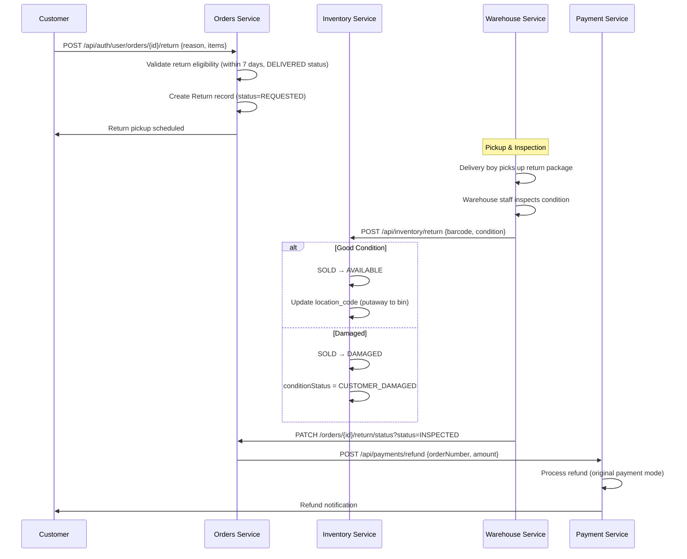

### 9.5 Real-Time Notification System

**WebSocket Event Types:**

```javascript
// All event types broadcast via STOMP /topic/admin/notifications
const NOTIFICATION_TYPES = {
  // Inventory
  INVENTORY_RESERVED:    'INVENTORY_RESERVED',
  INVENTORY_RELEASED:    'INVENTORY_RELEASED',
  LOW_STOCK_ALERT:       'LOW_STOCK_ALERT',
  OUT_OF_STOCK:          'OUT_OF_STOCK',
  STOCK_TRANSFERRED:     'STOCK_TRANSFERRED',
  REORDER_TRIGGERED:     'REORDER_TRIGGERED',

  // Orders
  ORDER_CONFIRMED:       'ORDER_CONFIRMED',
  ORDER_PROCESSING:      'ORDER_PROCESSING',
  ORDER_PICKED:          'ORDER_PICKED',
  ORDER_PACKED:          'ORDER_PACKED',
  ORDER_SHIPPED:         'ORDER_SHIPPED',
  ORDER_DELIVERED:       'ORDER_DELIVERED',
  ORDER_CANCELLED:       'ORDER_CANCELLED',
  ORDER_RETURNED:        'ORDER_RETURNED',

  // Warehouse
  PICK_LIST_CREATED:     'PICK_LIST_CREATED',
  PICK_LIST_ASSIGNED:    'PICK_LIST_ASSIGNED',
  GRN_CREATED:           'GRN_CREATED',
  GRN_APPROVED:          'GRN_APPROVED',
  DISPATCH_COMPLETED:    'DISPATCH_COMPLETED',

  // Alerts
  DELIVERY_DELAYED:      'DELIVERY_DELAYED',
  PAYMENT_FAILED:        'PAYMENT_FAILED',
  WAREHOUSE_OVERLOAD:    'WAREHOUSE_OVERLOAD',
  SCANNER_OFFLINE:       'SCANNER_OFFLINE',
  EXCESSIVE_RETURNS:     'EXCESSIVE_RETURNS',
};
```

**Notification Service:**

```java
@Service
public class NotificationService {

    private final SimpMessagingTemplate messagingTemplate;
    private final NotificationRepository notificationRepo;
    private final TwilioService twilioService;

    public void send(String type, String title, String message, Object data) {
        // 1. Persist to DB
        Notification notification = Notification.builder()
            .type(type).title(title).message(message)
            .data(objectMapper.writeValueAsString(data))
            .createdAt(LocalDateTime.now())
            .build();
        notificationRepo.save(notification);

        // 2. WebSocket broadcast
        NotificationEvent event = new NotificationEvent(type, title, message, data);
        messagingTemplate.convertAndSend("/topic/admin/notifications", event);

        // 3. SMS for critical alerts (LOW_STOCK, PAYMENT_FAILED)
        if (CRITICAL_TYPES.contains(type)) {
            twilioService.sendSMS(getAdminPhone(), title + ": " + message);
        }
    }
}
```

---

## Module 10: UI/UX Flow

### 10.1 Customer Checkout Flow

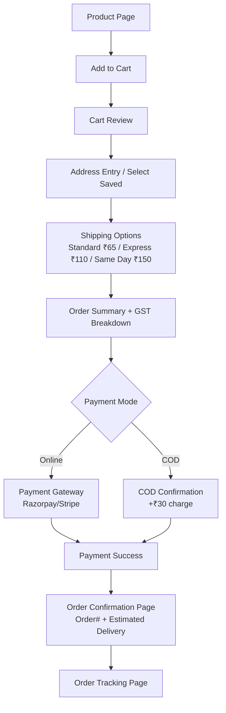

**Checkout Component — Key State:**

```javascript
// CheckoutPage.js
const [checkoutState, setCheckoutState] = useState({
  step: 'ADDRESS',          // ADDRESS | SHIPPING | PAYMENT | CONFIRMATION
  address: null,
  shippingRates: [],
  selectedRate: null,
  paymentMode: 'ONLINE',    // ONLINE | COD
  orderSummary: null,
  orderId: null,
});

// API calls sequence
const placeOrder = async () => {
  // 1. Validate address
  await validateAddress(checkoutState.address);

  // 2. Get shipping rates
  const rates = await fetch('/api/auth/user/shipping/rates', {
    method: 'POST',
    body: JSON.stringify({ weight, pincode, isCOD })
  });

  // 3. Create order (reserves inventory)
  const order = await fetch('/api/auth/user/orders/create', {
    method: 'POST',
    body: JSON.stringify({ items, address, shippingRateId, paymentMode })
  });

  // 4. Initiate payment (if online)
  if (checkoutState.paymentMode === 'ONLINE') {
    const payment = await fetch('/api/auth/user/payments/initiate', {
      method: 'POST',
      body: JSON.stringify({ orderNumber: order.orderNumber })
    });
    window.location.href = payment.gatewayUrl;
  }
};
```

### 10.2 Order Tracking Page

```javascript
// OrderTracking.js — real-time tracking with WebSocket
function OrderTracking({ orderNumber }) {
  const [order, setOrder] = useState(null);
  const [trackingEvents, setTrackingEvents] = useState([]);

  // Subscribe to order-specific updates
  useWarehouseSocket({
    topics: [`/topic/orders/${orderNumber}`],
    onMessage: (event) => {
      if (event.type === 'STATUS_UPDATE') {
        setOrder(prev => ({ ...prev, orderStatus: event.data.newStatus }));
        setTrackingEvents(prev => [event.data, ...prev]);
      }
    }
  });

  return (
    <div>
      <StatusTimeline status={order?.orderStatus} />  {/* existing component */}
      <TrackingMap awbNumber={order?.awbNumber} />
      <TrackingEventList events={trackingEvents} />
    </div>
  );
}
```

### 10.3 Warehouse Staff Dashboard

**Picker Dashboard:**

```javascript
// PickerDashboard.js
function PickerDashboard({ pickerId }) {
  const [myTasks, setMyTasks] = useState([]);

  useWarehouseSocket({
    topics: [`/topic/picker/${pickerId}`],
    onMessage: (event) => {
      if (event.type === 'PICK_LIST_ASSIGNED') {
        setMyTasks(prev => [...prev, event.data]);
        playNotificationSound();
      }
    }
  });

  const confirmPick = async (lineId, scannedBarcode) => {
    await fetch(`/api/warehouse/picklist/line/${lineId}/confirm`, {
      method: 'POST',
      body: JSON.stringify({ barcode: scannedBarcode })
    });
  };

  return (
    <div>
      <TaskQueue tasks={myTasks} />
      <BarcodeScanner onScan={confirmPick} />
      <BinLocationMap currentTask={activeTask} />
    </div>
  );
}
```

### 10.4 Admin Dashboard — Inventory Management Page

```javascript
// Inventory.js — extends existing component
// Key sections:
// 1. Stats bar: Available / Reserved / Low Stock / Out of Stock / Damaged
// 2. Warehouse selector (multi-warehouse view)
// 3. Rack/Shelf/Bin location tree view
// 4. Product search with real-time stock counts
// 5. Bulk actions: Add Stock / Transfer / Mark Damaged / Trigger Restock

const InventoryPage = () => {
  const [view, setView] = useState('LIST');  // LIST | LOCATION_MAP | ANALYTICS
  const [warehouseFilter, setWarehouseFilter] = useState('ALL');

  // Real-time stock updates
  useWarehouseSocket({
    topics: ['/topic/inventory/updates'],
    onMessage: (event) => {
      if (event.type === 'INVENTORY_RESERVED' || event.type === 'INVENTORY_RELEASED') {
        updateProductStock(event.data.productId, event.data);
      }
    }
  });
};
```

### 10.5 Reports & Analytics Dashboard

```javascript
// ReportsModern.js — extends existing component
// Charts powered by Recharts (existing dependency)

const reportSections = [
  {
    title: 'Sales Analytics',
    charts: [
      { type: 'LineChart', data: dailySalesData, title: 'Daily Revenue' },
      { type: 'BarChart', data: monthlySalesData, title: 'Monthly Revenue' },
    ]
  },
  {
    title: 'Warehouse Performance',
    charts: [
      { type: 'BarChart', data: pickingEfficiency, title: 'Picks/Hour by Worker' },
      { type: 'PieChart', data: orderStatusDist, title: 'Order Status Distribution' },
    ]
  },
  {
    title: 'Courier Performance',
    charts: [
      { type: 'BarChart', data: deliverySuccessRate, title: 'Delivery Success Rate %' },
      { type: 'LineChart', data: avgDeliveryDays, title: 'Avg Delivery Days' },
    ]
  },
  {
    title: 'Inventory Analytics',
    charts: [
      { type: 'BarChart', data: topSellingProducts, title: 'Top 10 Products' },
      { type: 'PieChart', data: stockStatusDist, title: 'Stock Status Distribution' },
    ]
  },
];

// API endpoints for reports
const reportAPIs = {
  dailySales:          '/api/auth/admin/reports/sales/daily',
  monthlySales:        '/api/auth/admin/reports/sales/monthly',
  topProducts:         '/api/auth/admin/reports/products/top-selling',
  returnAnalytics:     '/api/auth/admin/reports/returns',
  courierPerformance:  '/api/auth/admin/reports/courier-performance',
  warehouseKPIs:       '/api/auth/admin/reports/warehouse-kpis',
  customerTrends:      '/api/auth/admin/reports/customer-trends',
};
```

---

## Components and Interfaces

### API Gateway (:9999)

**Purpose**: Single entry point for all client traffic. Handles JWT validation, routing, CORS, and WebSocket proxying.

**Interface**:
```
Routes all /api/** requests to downstream services
Validates JWT on all /api/auth/** routes
Proxies WebSocket connections to /ws → warehouse-service:8088
```

**Responsibilities**:
- JWT token validation before forwarding requests
- Route matching and load balancing across service instances
- CORS header deduplication (`DedupeResponseHeader` filters)

---

### Auth Server (:2000)

**Purpose**: Issues and validates JWT tokens; manages users, roles, and warehouse staff.

**Interface**:
```
POST  /api/auth/login                          → JWT token
POST  /api/auth/register                       → New user
GET   /api/auth/admin/warehouse-staff          → Staff list
POST  /api/auth/admin/warehouse-staff/assign-shift
GET   /api/auth/admin/warehouse-staff/productivity
```

**Responsibilities**:
- JWT issuance and refresh
- RBAC role assignment (`SUPER_ADMIN`, `WAREHOUSE_ADMIN`, `INVENTORY_ADMIN`, `FINANCE_ADMIN`, `SUPPORT_ADMIN`)
- Warehouse staff management (shifts, attendance)

---

### Inventory Service (:9093)

**Purpose**: Owns individual stock unit lifecycle (AVAILABLE → RESERVED → SOLD → DAMAGED/RETURNED).

**Interface**:
```java
interface InventoryService {
    ReserveResponse reserve(String orderNumber, List<ReserveItem> items);
    void release(String orderNumber);
    void confirmSale(String orderNumber);
    ReturnResponse processReturn(String barcode, ConditionStatus condition);
    InventoryAggregate getAggregate(Long warehouseId, Long productId);
    List<LowStockAlert> getLowStock(Long warehouseId);
    void markDamaged(Long inventoryId, String reason);
    void transfer(Long productId, Long fromWarehouse, Long toWarehouse, int qty);
}
```

**REST Contracts**:
```
POST   /api/inventory/reserve
POST   /api/inventory/release
POST   /api/inventory/confirm-sale
POST   /api/inventory/return
GET    /api/inventory/aggregate/{warehouseId}/{productId}
GET    /api/inventory/low-stock
PATCH  /api/inventory/{id}/damage
POST   /api/inventory/transfer
GET    /api/inventory/warehouse/{id}
```

**Responsibilities**:
- Redis distributed locking per product during reservation
- Optimistic locking (`@Version`) to prevent concurrent oversell
- Aggregate cache invalidation and WebSocket broadcast on every mutation
- Scheduled job to release expired reservations

---

### Orders Service (:9091)

**Purpose**: Manages the full order lifecycle from creation through delivery and returns.

**Interface**:
```java
interface OrderService {
    Order createOrder(CreateOrderRequest req, Long customerId);
    void handlePaymentSuccess(String orderNumber);
    void handlePaymentFailure(String orderNumber);
    void updateStatus(String orderNumber, OrderStatus newStatus);
    void assignWarehouse(String orderNumber, Long warehouseId);
    void initiateReturn(String orderNumber, ReturnRequest req);
    Order getOrder(String orderNumber);
}
```

**REST Contracts**:
```
POST   /api/auth/user/orders/create
GET    /api/auth/user/orders/{orderNumber}
POST   /api/auth/user/orders/{id}/return
PATCH  /api/auth/admin/orders/{orderNumber}/status?status={STATUS}
PATCH  /api/auth/admin/orders/{orderNumber}/warehouse?warehouseId={id}
PATCH  /api/auth/admin/orders/{orderNumber}/courier?partner={name}&awb={awb}
POST   /api/auth/admin/orders/{orderNumber}/cancel
POST   /api/auth/admin/orders/{orderNumber}/refund
GET    /api/auth/admin/orders/{orderNumber}/tracking
```

**Responsibilities**:
- Order state machine enforcement (forward-only transitions)
- Transactional Outbox pattern for reliable event publishing
- Orchestrating inventory reservation, payment, and warehouse assignment

---

### Warehouse Service (:8088)

**Purpose**: Manages physical warehouse operations — GRN, putaway, pick lists, packing, dispatch — and serves as the WebSocket hub.

**Interface**:
```java
interface WarehouseService {
    GoodsReceiptNote createGRN(Long poId, Long warehouseId);
    void approveGRN(Long grnId);
    PickList createPickList(String orderNumber);
    void assignPickList(Long pickListId, Long pickerId, Long packerId, Long shippingId);
    void confirmPickLine(Long lineId, String scannedBarcode);
    PackDetail packOrder(String orderNumber, Long packerId);
    DispatchConfirmation dispatchOrder(String orderNumber, String awbNumber, String courier);
    String allocatePutawayLocation(Long productId, Long warehouseId, int qty);
}
```

**REST Contracts**:
```
POST  /api/warehouse/grn/create
POST  /api/warehouse/grn/{id}/lines
POST  /api/warehouse/grn/{id}/inspect
POST  /api/warehouse/grn/{id}/approve
POST  /api/warehouse/picklist/create
POST  /api/warehouse/picklist/{id}/assign
GET   /api/warehouse/picklist/my-tasks
POST  /api/warehouse/picklist/{id}/start
POST  /api/warehouse/picklist/line/{lineId}/confirm
GET   /api/warehouse/manager/dashboard/{warehouseId}
GET   /api/warehouse/manager/sla-breaches
POST  /api/warehouse/manager/reorder-request
```

**WebSocket Topics**:
```
/topic/admin/notifications       → All admin dashboard events
/topic/inventory/updates         → Stock count changes
/topic/orders/updates            → Order status changes
/topic/warehouse/queues          → Zone queue depths
/topic/picker/{pickerId}         → Picker task assignments
/topic/packer/{packerId}         → Packer task assignments
```

**Responsibilities**:
- GRN workflow (DRAFT → RECEIVED → INSPECTED → APPROVED → PUTAWAY_COMPLETE)
- Smart putaway location allocation (preferred product/category → nearest available bin)
- Batch pick list generation with travel-optimized bin ordering
- STOMP/SockJS WebSocket broker for real-time dashboard updates

---

### Shipping Service (:9097)

**Purpose**: Integrates with courier partners (Delhivery, BlueDart, Ekart) for rate calculation, AWB generation, and shipment tracking.

**Interface**:
```java
interface CourierAdapter {
    ShippingRate calculateRate(ShippingRateRequest request);
    AWBResponse generateAWB(ShipmentRequest request);
    TrackingResponse trackShipment(String awbNumber);
    void cancelShipment(String awbNumber);
}
```

**REST Contracts**:
```
POST  /api/shipping/rates
POST  /api/shipping/awb/generate
GET   /api/shipping/track/{awbNumber}
POST  /api/shipping/label/generate
POST  /api/shipping/cancel/{awbNumber}
GET   /api/shipping/performance
```

**Responsibilities**:
- Parallel rate fetching from all courier partners with Redis caching (1-hour TTL)
- Volumetric weight calculation: `max(actualWeight, length×height×breadth/5000)`
- Auto-selection of cheapest courier (or fastest for SAME_DAY/EXPRESS)
- Shipping label PDF generation and S3 upload

---

### Payment Service (:9096)

**Purpose**: Handles payment gateway integration, COD management, refunds, and GST reporting.

**REST Contracts**:
```
POST  /api/payments/initiate          → Gateway redirect URL
POST  /api/orders/payment-callback    → Gateway webhook
POST  /api/payments/refund            → Initiate refund
GET   /api/auth/admin/payments/revenue/daily
GET   /api/auth/admin/payments/revenue/monthly
GET   /api/auth/admin/payments/cod/settlements
GET   /api/auth/admin/payments/refunds/pending
GET   /api/auth/admin/payments/gst-report
POST  /api/auth/admin/payments/refund/approve
```

**Responsibilities**:
- Razorpay/Stripe gateway integration (no card data stored — PCI-DSS delegated)
- COD collection tracking and settlement
- Refund processing bounded by original payment amount
- GST invoice generation

---

### Products Service (:9094)

**Purpose**: Manages the product catalog, pricing, SKUs, and supplier relationships.

**REST Contracts**:
```
GET   /api/products/getByProductId/{productId}
GET   /api/products/all
POST  /api/auth/admin/products/create
PATCH /api/auth/admin/products/{id}
POST  /api/auth/admin/pricing
GET   /api/auth/admin/suppliers
POST  /api/auth/admin/suppliers
```

**Responsibilities**:
- Product catalog with dimensions (weight, length, height, breadth) for shipping calculation
- SKU management and barcode assignment
- Pricing with MRP, selling price, cost price, GST rate
- Supplier management for purchase order workflows

---

## Data Models

### Inventory Unit

Tracks individual stock units by barcode. Owned by **inventory-service**.

```java
// inventory table
{
  id:               Long (PK),
  barcode:          String (UNIQUE),
  productId:        Long,
  warehouseId:      Long,
  locationCode:     String,           // bin location e.g. WH01-A-01-B-L2-BIN03
  inventoryStatus:  AVAILABLE | RESERVED | SOLD | DAMAGED,
  conditionStatus:  GOOD | CUSTOMER_DAMAGED | WAREHOUSE_DAMAGED,
  platformStatus:   ENABLED | DISABLED,
  mrp:              Decimal,
  sellingPrice:     Decimal,
  buyPrice:         Decimal,
  stockSource:      SUPPLIER | CUSTOMER_RETURN,
  version:          Long,             // optimistic lock
  createdAt:        DateTime,
  updatedAt:        DateTime
}
```

**State Machine**: `AVAILABLE → RESERVED → SOLD`, `SOLD → AVAILABLE | DAMAGED` (return), `AVAILABLE → DAMAGED`

---

### Inventory Reservation

Links a reserved stock unit to an order. Owned by **inventory-service**.

```java
// inventory_reservation table
{
  id:                  Long (PK),
  orderNumber:         String,
  productId:           Long,
  inventoryId:         Long,
  barcode:             String (UNIQUE),
  quantity:            Int,
  reservationStatus:   RESERVED | RELEASED | CONFIRMED,
  reservedAt:          DateTime,
  expiresAt:           DateTime        // 30-minute TTL; cleaned up by scheduler
}
```

---

### Order

Core order record. Owned by **orders-service**.

```java
// orders table
{
  id:               Long (PK),
  orderNumber:      String (UNIQUE),
  customerId:       Long,
  orderStatus:      PENDING | CONFIRMED | PROCESSING | PACKED | SHIPPED |
                    OUT_FOR_DELIVERY | DELIVERED | CANCELLED | RETURNED | FAILED,
  paymentStatus:    PENDING | SUCCESS | FAILED | REFUNDED,
  totalAmount:      Decimal,
  paymentMode:      ONLINE | COD | WALLET,
  priority:         NORMAL | HIGH | SAME_DAY,
  warehouseId:      Long,
  awbNumber:        String,
  courierPartner:   String,
  deliveryPincode:  String,
  deliverySpeed:    STANDARD | EXPRESS | SAME_DAY,
  shippingCharge:   Decimal,
  createdAt:        DateTime,
  updatedAt:        DateTime
}
```

---

### Warehouse & Location

Physical warehouse hierarchy. Owned by **warehouse-service**.

```java
// warehouses table
{
  id:             Long (PK),
  code:           String (UNIQUE),   // e.g. WH-PUN-001
  name:           String,
  city:           String,
  pincode:        String,
  capacitySqft:   Decimal,
  isActive:       Boolean
}

// warehouse_locations table — full bin hierarchy
{
  id:                   Long (PK),
  warehouseId:          Long,
  locationCode:         String (UNIQUE),  // WH01-A-01-B-L2-BIN03
  locationType:         AREA | AISLE | BAY | LEVEL | BIN,
  maxCapacity:          Decimal,
  currentCapacity:      Decimal,
  maxWeight:            Decimal,
  temperatureControlled: Boolean,
  hazmatApproved:       Boolean,
  preferredProductId:   Long,            // smart putaway hint
  preferredCategoryId:  Long,
  isAvailable:          Boolean
}
```

---

### Goods Receipt Note (GRN)

Tracks inbound stock from suppliers. Owned by **warehouse-service**.

```java
// goods_receipt_notes table
{
  id:                 Long (PK),
  grnNumber:          String (UNIQUE),
  poId:               Long,
  warehouseId:        Long,
  status:             DRAFT | RECEIVED | INSPECTED | APPROVED | PUTAWAY_COMPLETE,
  receivedAt:         DateTime,
  receivedBy:         Long,
  inspectedBy:        Long,
  inspectionNotes:    Text,
  putawayCompleted:   Boolean
}

// grn_lines table
{
  id:               Long (PK),
  grnId:            Long,
  productId:        Long,
  barcode:          String,
  orderedQty:       Int,
  receivedQty:      Int,
  damagedQty:       Int,
  putawayCompleted: Boolean,
  locationCode:     String
}
```

---

### Pick List

Drives the picking workflow for an order. Owned by **warehouse-service**.

```java
// pick_lists table
{
  id:                   Long (PK),
  orderNumber:          String (UNIQUE),
  status:               PENDING | IN_PROGRESS | COMPLETED,
  warehouseId:          Long,
  assignedPickerId:     Long,
  assignedPackerId:     Long,
  assignedShippingId:   Long,
  assignedAt:           DateTime,
  startedAt:            DateTime,
  completedAt:          DateTime
}

// pick_list_lines table
{
  id:           Long (PK),
  pickListId:   Long,
  productId:    Long,
  barcode:      String,
  quantity:     Int,
  locationCode: String,   // bin to pick from
  confirmed:    Boolean,
  confirmedAt:  DateTime
}
```

---

### Shipment

Tracks courier assignment and delivery. Owned by **shipping-service**.

```java
// shipments table
{
  id:                Long (PK),
  orderNumber:       String (UNIQUE),
  awbNumber:         String (UNIQUE),
  courierPartner:    String,
  weightKg:          Decimal,
  volumetricWeight:  Decimal,
  billableWeight:    Decimal,
  shippingCharge:    Decimal,
  isCod:             Boolean,
  deliverySpeed:     STANDARD | EXPRESS | SAME_DAY,
  status:            CREATED | PICKED_UP | IN_TRANSIT | OUT_FOR_DELIVERY |
                     DELIVERED | FAILED | RETURNED,
  estimatedDelivery: Date,
  labelUrl:          String
}
```

---

### Payment

Records payment transactions. Owned by **payment-service**.

```java
// payments table
{
  id:              Long (PK),
  orderNumber:     String,
  customerId:      Long,
  amount:          Decimal,
  paymentMode:     ONLINE | COD | WALLET,
  paymentStatus:   PENDING | SUCCESS | FAILED | REFUNDED,
  gatewayName:     String,       // Razorpay | Stripe
  gatewayTxnId:    String,
  gstAmount:       Decimal,
  codCollected:    Boolean,
  createdAt:       DateTime
}
```

---

## Error Handling

### Inventory Errors

| Error | Condition | Response | Recovery |
|---|---|---|---|
| `InsufficientStockException` | Available units < requested qty | 409 Conflict + available count | Show "Only N left" to customer |
| `ConcurrentReservationException` | Redis lock not acquired | 503 Retry-After: 1s | Retry up to 3 times with backoff |
| `OptimisticLockException` | `@Version` mismatch on save | 409 Conflict | Reload and retry |
| `ReservationExpiredException` | Reservation TTL exceeded | 410 Gone | Release units, prompt re-order |

### Order Errors

| Error | Condition | Response | Recovery |
|---|---|---|---|
| `PaymentFailedException` | Gateway returns failure | 402 Payment Required | Release inventory reservation |
| `WarehouseCapacityException` | No bin available for putaway | 507 Insufficient Storage | Alert warehouse manager |
| `WeightMismatchException` | Actual vs expected weight > tolerance | 422 Unprocessable | Hold for manual inspection |
| `CourierUnavailableException` | All couriers return error | 503 Service Unavailable | Fallback to next courier |

### Error Handling Pattern (Spring Boot)

```java
@RestControllerAdvice
public class GlobalExceptionHandler {

    @ExceptionHandler(InsufficientStockException.class)
    public ResponseEntity<ErrorResponse> handleInsufficientStock(InsufficientStockException ex) {
        return ResponseEntity.status(HttpStatus.CONFLICT)
            .body(ErrorResponse.builder()
                .code("INSUFFICIENT_STOCK")
                .message(ex.getMessage())
                .data(Map.of("productId", ex.getProductId(), "available", ex.getAvailable()))
                .build());
    }

    @ExceptionHandler(OptimisticLockingFailureException.class)
    public ResponseEntity<ErrorResponse> handleOptimisticLock(OptimisticLockingFailureException ex) {
        return ResponseEntity.status(HttpStatus.CONFLICT)
            .body(ErrorResponse.builder()
                .code("CONCURRENT_MODIFICATION")
                .message("Resource was modified concurrently. Please retry.")
                .build());
    }
}
```

---

## Testing Strategy

### Unit Testing

- **Inventory reservation logic**: Test lock acquisition, optimistic lock retry, insufficient stock
- **Shipping rate calculation**: Test volumetric weight, COD surcharge, zone-based pricing
- **Order status machine**: Test valid/invalid transitions
- **Putaway algorithm**: Test preferred location, category fallback, capacity check

### Property-Based Testing

**Library**: JUnit 5 + jqwik (Java) for backend; fast-check for React frontend

**Properties to verify:**

```java
// Property: Reserved stock never exceeds available stock
@Property
void reservedNeverExceedsAvailable(@ForAll @IntRange(min=1, max=1000) int totalStock,
                                    @ForAll @IntRange(min=1, max=500) int reserveQty) {
    // Setup: totalStock units AVAILABLE
    // Action: reserve reserveQty
    // Assert: if reserveQty <= totalStock → reserved == reserveQty, available == totalStock - reserveQty
    //         if reserveQty > totalStock → InsufficientStockException thrown
}

// Property: Shipping charge always positive and increases with weight
@Property
void shippingChargeMonotonicallyIncreases(@ForAll @DoubleRange(min=0.1, max=50.0) double weight) {
    double charge1 = calculateCharge(weight, "560001", false, "Delhivery");
    double charge2 = calculateCharge(weight + 1.0, "560001", false, "Delhivery");
    assertThat(charge2).isGreaterThan(charge1);
}

// Property: Order status transitions are always forward (no regression)
@Property
void orderStatusNeverRegresses(@ForAll OrderStatus from, @ForAll OrderStatus to) {
    int fromIdx = STATUS_FLOW.indexOf(from);
    int toIdx = STATUS_FLOW.indexOf(to);
    if (fromIdx >= 0 && toIdx >= 0 && toIdx < fromIdx) {
        assertThatThrownBy(() -> orderService.updateStatus(orderNumber, to))
            .isInstanceOf(InvalidStatusTransitionException.class);
    }
}
```

### Integration Testing

- End-to-end order flow: place order → reserve inventory → payment → warehouse assignment → pick → pack → dispatch
- WebSocket event delivery: verify admin dashboard receives events within 500ms
- Multi-warehouse stock sync: verify aggregate counts match sum of individual units
- Concurrent reservation: 10 simultaneous requests for last 5 units → exactly 5 succeed

### Performance Considerations

- **Inventory reservation**: Target < 200ms p99 with Redis locking
- **Shipping rate calculation**: Target < 500ms with Redis cache (< 2s cold)
- **WebSocket broadcast**: Target < 100ms from event to client receipt
- **Admin dashboard load**: Target < 1s initial load with pagination (50 orders/page)
- **Database indexes**: All foreign keys and status/date filter columns indexed (see schema above)
- **Redis aggregate cache**: 30-second TTL prevents DB hammering on high-traffic product pages

### Security Considerations

- **JWT validation**: All `/api/auth/**` routes validated at API Gateway before routing
- **Role enforcement**: `@PreAuthorize` on all admin/warehouse endpoints
- **Inventory locking**: Redis SETNX prevents race conditions; `@Version` provides DB-level safety net
- **Payment data**: No card data stored; gateway tokenization only; PCI-DSS delegated to Razorpay/Stripe
- **Barcode scanning**: Scanner input validated against known product barcodes before processing
- **Outbox pattern**: Ensures at-least-once event delivery without distributed transactions
- **CORS**: Configured per-service and deduplicated at gateway (existing `DedupeResponseHeader` filters)

---

## Dependencies

### Existing (already in project)

| Dependency | Version | Purpose |
|---|---|---|
| Spring Boot | 3.x | Microservice framework |
| Spring Cloud Gateway | 4.x | API routing + JWT validation |
| Spring Data JPA | 3.x | ORM for MySQL |
| Spring WebSocket + STOMP | 3.x | Real-time events |
| Lombok | 1.18.x | Boilerplate reduction |
| React | 19.x | Frontend SPA |
| @stomp/stompjs | 7.x | WebSocket client |
| sockjs-client | 1.6.x | WebSocket fallback |
| recharts | 3.x | Dashboard charts |
| lucide-react | 0.575.x | Icons |
| jspdf + jspdf-autotable | 4.x / 5.x | Invoice/label PDF generation |
| jsbarcode | 3.12.x | Barcode rendering |
| Twilio | — | SMS notifications |
| Cloudinary | — | Image storage |

### New Dependencies Required

| Dependency | Purpose |
|---|---|
| `spring-boot-starter-data-redis` | Redis distributed locking + caching |
| `spring-boot-starter-cache` | `@Cacheable` annotations |
| `jqwik` (test scope) | Property-based testing (Java) |
| `fast-check` (devDependency) | Property-based testing (React) |
| Delhivery SDK / REST client | Courier API integration |
| BlueDart REST client | Courier API integration |
| Ekart REST client | Courier API integration |

---

## Correctness Properties

The following invariants must hold at all times across the system:

### Property 1: Stock Conservation

`available + reserved + sold + damaged = total_ever_received - total_discarded` for every (productId, warehouseId) pair.

### Property 2: No Overselling

For any product at any point in time, `reserved_count ≤ available_count_before_reservation`. The Redis lock + `@Version` optimistic lock enforces this.

### Property 3: Order-Inventory Consistency

Every order in status `CONFIRMED` or later has a corresponding `InventoryReservation` with status `RESERVED` or `CONFIRMED`. Every `DELIVERED` order has all reservations in `CONFIRMED` state.

### Property 4: Status Monotonicity

Order status transitions only move forward in the defined flow (`PENDING → CONFIRMED → PROCESSING → PACKED → SHIPPED → OUT_FOR_DELIVERY → DELIVERED`). Cancellation is only permitted before `SHIPPED`.

### Property 5: Shipping Charge Positivity

For any valid (weight, pincode, courier) combination, `shippingCharge > 0`. COD charge ≥ non-COD charge for the same parameters.

### Property 6: GRN Completeness

A GRN transitions to `PUTAWAY_COMPLETE` if and only if all `GRNLine.putawayCompleted = true`.

### Property 7: PickList Completeness

A PickList transitions to `COMPLETED` if and only if all `PickListLine.confirmed = true`.

### Property 8: Refund Bound

`refund_amount ≤ original_payment_amount` for any return/refund operation.

### Property 9: Reservation Expiry

Any `InventoryReservation` with `expiresAt < now()` and status `RESERVED` must be released (units returned to `AVAILABLE`) by the scheduled cleanup job.

### Property 10: WebSocket Delivery

Every state-changing operation (order status update, inventory mutation, GRN approval) publishes a corresponding WebSocket event to `/topic/admin/notifications` within the same transaction boundary (via Outbox pattern).
